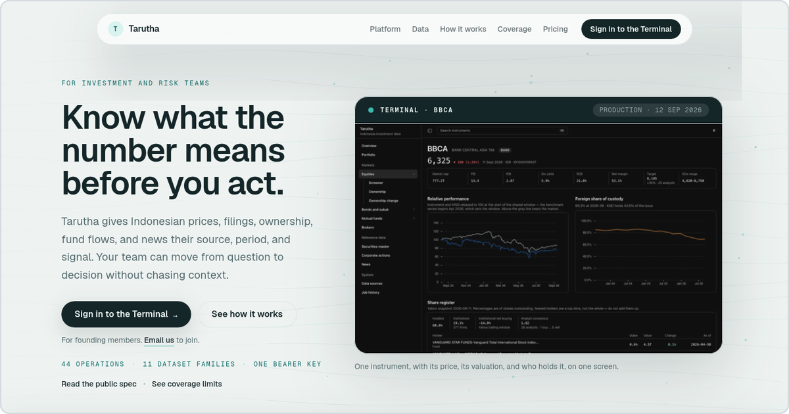
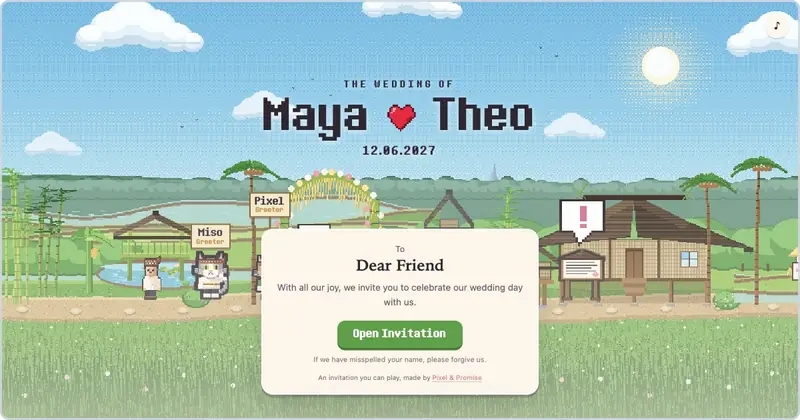

### Product manager and builder in Jakarta

Senior Product Manager at an Indonesian investment app. Co-founder and CEO of [Teman Bisnis Digital](https://temanbizz.digital), a studio that builds software for founders and ships a few products of its own.

Seven years in payments, fintech and small-business products. Before my current role: Payfazz, Alterra, DOKU and GoToko (GoTo × Unilever). On my own products I write the spec and, with AI coding agents, most of the code.

#### Shipping now

<table>
  <tr>
    <td width="50%" valign="top">
      
      
<a href="https://tarutha.co"><b>Tarutha</b></a> 
      Indonesian capital-market data with the source beside every number: prices, filings, ownership, fund flows and news. One API, an MCP server for AI agents, and a web terminal for investment and risk teams. 
      Rust · Python · Next.js · <a href="https://github.com/furyoktria/tarutha-quickstart">Quickstart</a>

    </td>
    <td width="50%" valign="top">
      
      
<a href="https://pixelandpromise.com"><b>Pixel &amp; Promise</b></a> 
      Wedding invitations your guests can play: a pixel-art game with RSVP, a wish wall and music. It started as our own wedding invitation and went from first commit to live store in a week. 
      Cloudflare Workers · 110 worlds · From $199

    </td>
  </tr>
</table>

Also in progress: **Titah**, Indonesian regulations as an API and MCP server that AI agents can query, in five languages. Private beta.

#### Studio work

- **[ReKlub](https://reklub.co)**, a performance and wellness center in Jakarta. We built the website, the member booking app, the coach app, the admin back office and the API behind them. 2026.
- **Dash Electric** (Antler ID5), EV last-mile delivery. Operations back end, dashboard and a delivery API for business clients. 2024.
- **Tumbuh.in** (Antler ID4), loans and lines of credit for small businesses. Lender and internal back offices. 2023.
- **IKN Nusantara gateway**, an API platform that connects 29,000+ partners to Indonesia's new capital city.

#### Track record

- **Wintermar Offshore**, Product Lead, 2023. Led two designers and four engineers to build three products from scratch for a marine services company that operates in 12+ APAC countries.
- **GoToko** (GoTo × Unilever), Senior PM, Core Product, 2022 to 2023. Launched a ready-stock buying model in two weeks that took the average warung order in Bali past IDR 1M. Cut a master-data SLA from about 48 hours to under 10 minutes. The company grew GMV 10× in 2022.
- **DOKU**, Product Manager, Growth, 2020 to 2022. Launched Payment Link, Assisted Integration and Jokul Retail, which brought in more than IDR 217B in revenue by Q1 2022.
- **Payfazz**, Associate PM, Cash-In, 2019. Ran 10 cash-in channels and 2 payment gateways at 99.99% uptime for a warung agent network, and cut subsidy cost by 27% in six months.

#### Open source

- **[tarutha-quickstart](https://github.com/furyoktria/tarutha-quickstart)**. Three Python examples and a Claude setup for the Tarutha API. The first one runs without a key.
- **[claude-skills](https://github.com/furyoktria/claude-skills)**. Three Claude skills: BPOM cosmetics notification for Indonesia, landing-page design that converts, and license-safe UI library sourcing.
- **[acroformer](https://github.com/furyoktria/acroformer)**. Turns flat PDF forms into fillable AcroForms. It finds boxes, checkboxes and dotted lines, and names each field from its printed label.
- **[x-bookmarks-dumper](https://github.com/furyoktria/x-bookmarks-dumper)**. Exports all your X bookmarks to JSON from the browser console. No API key, no paid tier.

#### Teaching

Product management mentor on [ADPList](https://adplist.org/mentors/fury-oktria-putra) since 2021, with 100+ mentees in Indonesia, Singapore, India, Pakistan and Turkey. Practitioner lecturer at Universitas Ahmad Dahlan, and instructor at Apiary Academy, RevoU and Binar Academy. Talk: [Love & Hate as a Product Manager](https://www.youtube.com/watch?v=NiMoybMhy6o).

#### Contact

Happy to talk about fintech, Indonesian market data, and small teams that ship with AI agents.

[LinkedIn](https://www.linkedin.com/in/furyoktria/) · [X](https://x.com/furyoktria) · [fury@temanbizz.digital](mailto:fury@temanbizz.digital)

Most of my work lives in private repositories, so the contribution graph below says more than the repo list.
